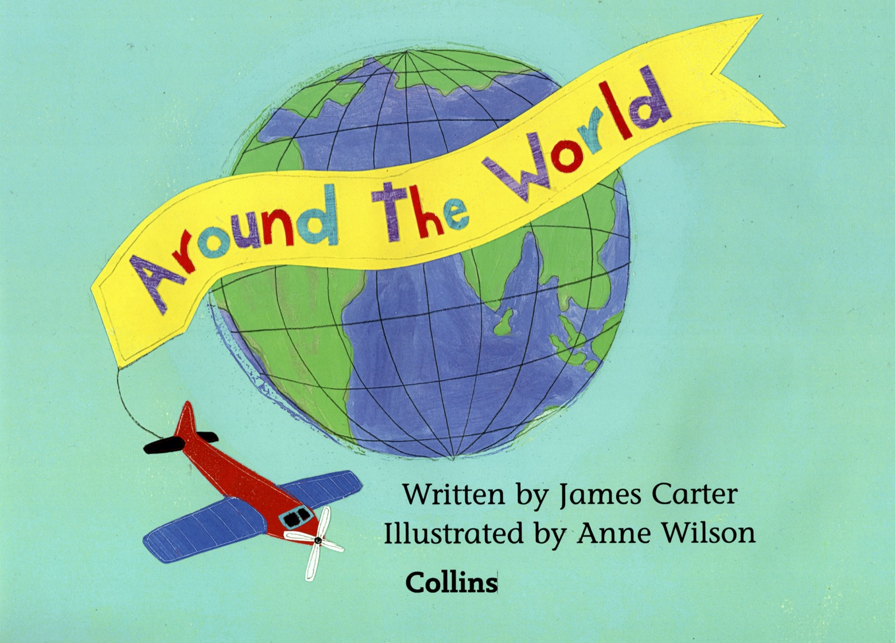

## Band 03 Yellow

### 01. Around the World

We went by train, by boat, by plane, around the **world** and back again.

We went throught **sun**, we went through **snow**. Then where did we go?

We went to ... **Africa**! Then where did we go?

We went to ... **India**! Then where did we go?

We wen to ... **China**! Then where did we go?

**Home** sweet **home**!

#### New Words

Africa, India, train, boat, plane, world, China, snow, home, sun