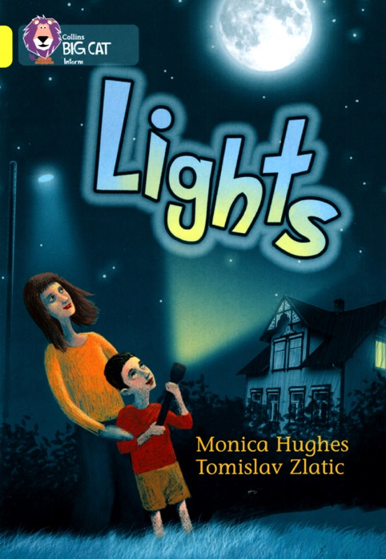

### 02. Lights

At **night**, the **sun** goes **down**.

We need **light** to see at **night**.

We can see by **moonlight**.

We can see by **starlight**.

We can see by **firelight**.

We can see by **torchlight**.

We can see by **eletric light**.

We can see by **lamplight**.

We can see by a **night light**. Good **night**!

In the **morning**, the **sun** comes up.

Then we can see by **sunlight**.

#### New Words

> moonlight, starlight, firelight, torchlight, eletric light, lamplight, night light, sunlight
