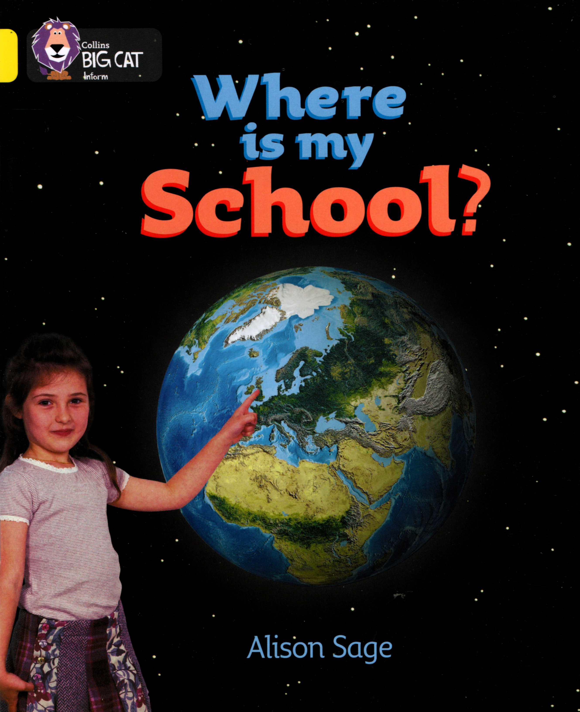

### 04. Where is my School?

This is my table.

Leah sits next to me.

This is my **classroom**.

My **teacher**'s name is Miss Salim.

This is my school.

My school is in **London**.

I go to school with Mum.

I go to school on a bus.

**London** is in **England**.

**England** is part of the **United Kingdom**.

The **United Kingdom** is on **Earth**.

**Earth** is in **space**.

My school is here. Where is your school?

#### New Words

> Africa, England, Asia, Europe, Australia, hall, classroom, London, computer, lunch box, earth, North America, Northern Ireland, space, plant, teacher, playground, United Kingdom, Scotland, Wales, South America
