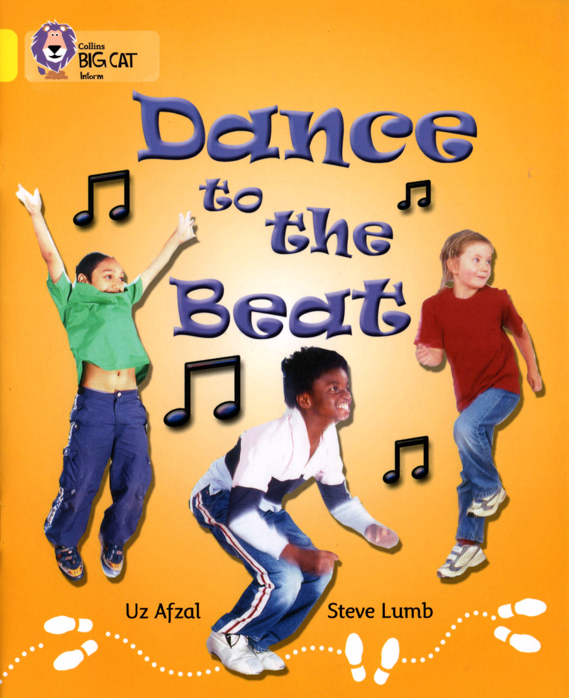

### 06. Dance to the Beat

Can you **dance**?

**First**, you **listen** to the **beat** of the **music**.

**Next**, you **skip around** to the **beat** of the **music**.

Then you **stamp** your **feet** to the **beat** of the **music**.

Then you **wave** your **arms** to the **beat** of the **music**.

Now you **clap** your **hands** to the **beat** of the **music**.

You can **shake** your **head** to the **beat** of the **music**.

**Stop** when you hear the **last beat** of the **music**.

#### New Words

> arm, foot, around, hand, beat, head, clap, hear, dance, last, first, listen, music, stamp, next, stop, shake, wave, skip
