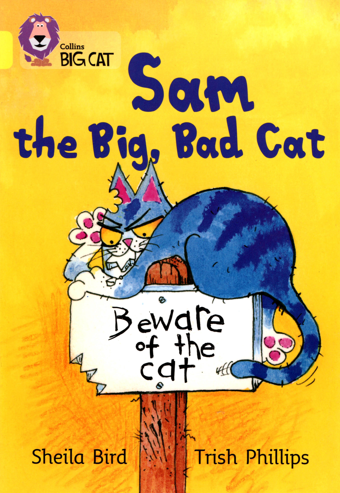

### 07. Sam the Big, Bad Cat

Tom had a big, bad cat called Sam. One day Sam didn't feel **well**.

Tom said, "I'll take you to the **vet**."

Sam didn't want to go to the **vet**.

He ran away and hid **under** his bed. Tom **found** him.

Sam hid **under** the table. Tom **found** him.

Sam hid in the **cupboard**. Tom **found** him.

Sam hid in the **shower**. Tom **found** him. Tom got very wet.

Tom said, "I don't fell **well** at all. I'm going to bed."

Sam was feeling much **better**.

#### New Words

> bed, run away, better, shower, cupboard, under, feel, vet, find, well, hide, wet
