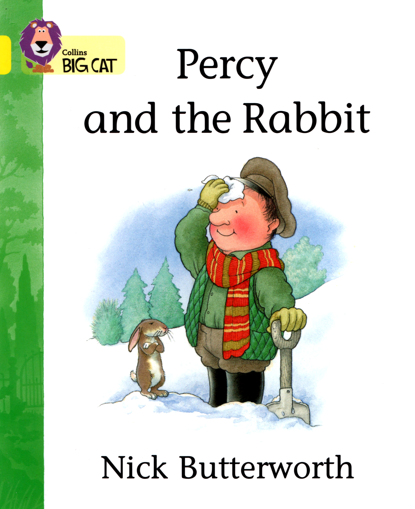

### 09. Percy and the Rabbit

Percy the **Park Keeper** was in the **park**.

A **rabbit** came to see him.

Percy said, "Look at the **snow**."

The **rabbit** said, "Look at the **mice**. They're playing in my house."

Percy said, "**Mice**! Please don't play in the **rabbit**'s house." The **mice** went away.

Percy dug the **snow**. He dug and dug.

Then Percy said, "Where's my cap? Where's my scarf?"

The **rabbit** said, "Look at your **gloves**!"

The **rabbit** said, "Look! The **mice** are playing with your things."

Percy said, "Never mind. They are having a lot of fun."

#### New Words

> cap, mouse, dig, never mind, fun, park, glove, rabbit, go away, scarf, house, snow, keeper
