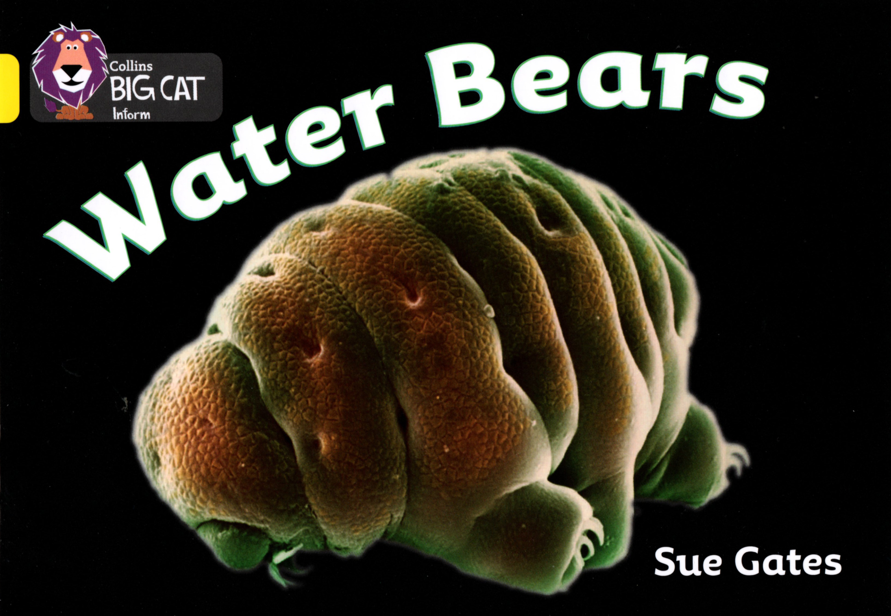

### 04. Water Bears

Here's a **water bear**.

Here are some more.

**Water bears** live in **wet** places like this.

They are very, very tiny. Ten of them could fit here.

We need this to see a **water bear**.

It makes tiny things look bigger.

This is what we do.

This is what we see.

You can look for **water bears** in your **garden**.

Finding them is fun.

#### New Words

> about, mouth, fit, tiny, garden, water bear, hair, wet, moss
